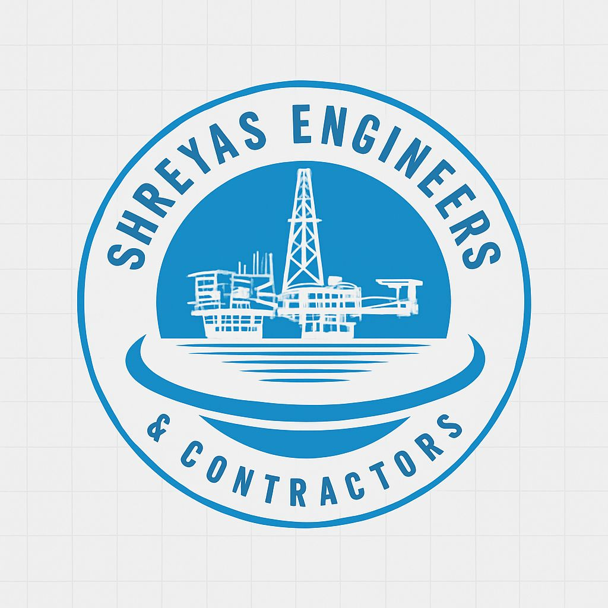

<!DOCTYPE html>
<html lang="en">
<head>
  <meta charset="UTF-8" />
  <meta name="viewport" content="width=device-width, initial-scale=1" />
  <title>Shreyas Engineers and Contractors</title>
</head>
<body>
  <header>
    

      
      <h1>Shreyas Engineers and Contractors</h1>
      
Trusted Experts in Offshore Platform Engineering for ONGC

      <a href="#contact" class="cta-btn">Contact Us</a>
    

  </header>

  <section class="about">
    

      <h2>About Us</h2>
      
Shreyas Engineers and Contractors is a top-ranked engineering and contracting firm, renowned for our specialization in offshore platform projects, oil rigging, and drilling fabrication works. We are a proud and long-standing contractor for ONGC, delivering world-class offshore infrastructure with precision and commitment.

    

  </section>

  <section class="services">
    

      <h2>Our Services</h2>
      <ul>
        <li>Offshore platform design and construction</li>
        <li>Oil rig structural fabrication and assembly</li>
        <li>Drilling platform engineering solutions</li>
        <li>Welding, pipeline, and structural works</li>
        <li>Maintenance and upgrade of offshore systems</li>
      </ul>
    

  </section>

  <section class="clients">
    

      <h2>Our Clients</h2>
      
We are a preferred contractor for ONGC and serve major oil and gas companies in India.

    

  </section>

  <section id="contact" class="contact">
    

      <h2>Contact Us</h2>
      

        
Email: <a href="mailto:shreyasengineeringsongc@gmail.com">shreyasengineeringsongc@gmail.com</a>

        
Phone: <a href="tel:+919820064872">+91 9820064872</a>

        
Address: <a href="https://www.google.com/search?sca_esv=a0f38eb77c23691f&amp;rlz=1C1SQJL_enIN915IN915&amp;sxsrf=AE3TifMii2W0R4lbr_zmO83vGg6WPFk8hA:1753805249333&amp;q=shreyas+engineers+and+contractors+address&amp;ludocid=9843437290265415290&amp;sa=X&amp;ved=2ahUKEwjl75DXueKOAxW91TgGHdMEBY4Q6BN6BAgwEAI" target="_blank" rel="noopener noreferrer">S1/S2 Tandon Chl, 28 JB Road, Barrister Nath Pai Marg, Cotton Green (W), Mumbai, Maharashtra 400033</a>

      

    

  </section>

  <footer>
    

      
&copy; 2025 Shreyas Engineers and Contractors. All rights reserved.

    

  </footer>

  
</body>
</html>
